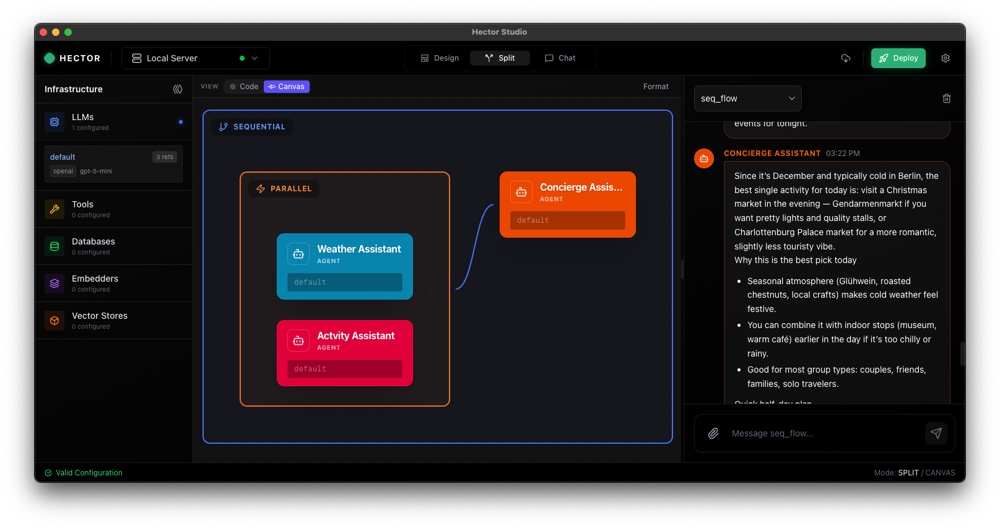

---
hide:
  - navigation
  - toc
template: home.html
is_homepage: true
---

<div class="hero-container">
  <h1 class="hero-slogan">
    Your Agents. Your Infrastructure.<br>
    <span class="text-gradient">One Binary. Full Sovereignty.</span>
  </h1>

  <div class="hero-intro">
    <p>Open-source AI agent runtime. One Go binary, zero dependencies, full control.</p>
  </div>

  <div class="hero-terminal">
    <div class="window-header">
      <div class="window-dots">
        <div class="window-dot red"></div>
        <div class="window-dot yellow"></div>
        <div class="window-dot green"></div>
      </div>
      <div class="install-tabs">
        <button class="install-tab active" data-tab="macos">macOS</button>
        <button class="install-tab" data-tab="linux">Linux</button>
        <button class="install-tab" data-tab="windows">Windows</button>
        <button class="install-tab" data-tab="docker">Docker</button>
      </div>
      <button class="copy-btn" title="Copy to clipboard">
        <svg width="16" height="16" viewBox="0 0 16 16" fill="none"><path d="M5.5 2h6.25A1.25 1.25 0 0 1 13 3.25V11" stroke="currentColor" stroke-width="1.3"/><rect x="3" y="4" width="8" height="9.5" rx="1.25" stroke="currentColor" stroke-width="1.3"/></svg>
      </button>
    </div>
    <div class="window-content">
      <div class="install-panel active" data-tab="macos">
        <span class="prompt">$</span> <span class="command">curl -fsSL https://gohector.dev/install.sh | sh</span><br>
        <span class="prompt">$</span> <span class="command">hector serve</span>
      </div>
      <div class="install-panel" data-tab="linux">
        <span class="prompt">$</span> <span class="command">curl -fsSL https://gohector.dev/install.sh | sh</span><br>
        <span class="prompt">$</span> <span class="command">hector serve</span>
      </div>
      <div class="install-panel" data-tab="windows">
        <span class="prompt">PS&gt;</span> <span class="command">irm https://gohector.dev/install.ps1 | iex</span><br>
        <span class="prompt">PS&gt;</span> <span class="command">hector serve</span>
      </div>
      <div class="install-panel" data-tab="docker">
        <span class="prompt">$</span> <span class="command">docker run -p 8080:8080 ghcr.io/verikod/hector:latest serve</span>
      </div>
    </div>
  </div>

  <div class="hero-cta" markdown="1">
    <a href="getting-started/quick-start/" class="btn btn-primary">Get Started</a>
    <a id="download-btn" href="https://github.com/verikod/hector/releases/latest" class="btn btn-secondary">Download</a>
  </div>

  <div class="deploy-strip">
    <p class="deploy-strip-label">Or deploy instantly</p>
    <div class="deploy-buttons">
      <a href="https://railway.com/deploy/NVoVdT?referralCode=uJnhIQ" target="_blank" rel="noopener">
        
      </a>
      <a href="https://render.com/deploy?repo=https://github.com/verikod/hector" target="_blank" rel="noopener">
        
      </a>
      <a href="https://heroku.com/deploy?template=https://github.com/verikod/hector" target="_blank" rel="noopener">
        
      </a>
    </div>
    <a href="getting-started/deploy/" class="deploy-strip-more">More providers →</a>
  </div>
</div>

<!-- Sovereign by Design Section -->
<div class="story-section" style="border-top: none; padding: 2.5rem 2rem 3.5rem;">
  <div class="story-container" style="display: flex; flex-direction: column; align-items: center; text-align: center; max-width: 1100px; gap: 1.5rem;">
    <div class="story-text" style="width: 100%;">
      <h2 class="story-title" style="margin-bottom: 0.5rem;">Self-Sovereign AI. No Strings Attached.</h2>
      <p style="font-size: 1.1rem; margin: 0;">Every byte stays on your machines. Every standard is open. Every line is auditable.</p>
    </div>
    <ul style="display: grid; grid-template-columns: repeat(3, 1fr); gap: 1.5rem; list-style: none; margin: 0; padding: 0; width: 100%;">
      <li class="sovereign-card" style="background: rgba(255,255,255,0.03); border: 1px solid rgba(16,185,129,0.2); border-radius: 12px; padding: 1.25rem; text-align: left; transition: all 0.3s ease; box-shadow: 0 0 20px rgba(16,185,129,0.05);">
        <strong style="display: block; margin-bottom: 0.4rem; color: #10b981; font-size: 1rem;">Single Binary. Zero Dependencies.</strong>
        <span style="color: #94a3b8; font-size: 0.9rem; line-height: 1.5;">One ~30MB Go executable. No interpreters, no virtualenvs, no package managers. Copy to a server and run. Works out of the box.</span>
      </li>
      <li class="sovereign-card" style="background: rgba(255,255,255,0.03); border: 1px solid rgba(16,185,129,0.2); border-radius: 12px; padding: 1.25rem; text-align: left; transition: all 0.3s ease; box-shadow: 0 0 20px rgba(16,185,129,0.05);">
        <strong style="display: block; margin-bottom: 0.4rem; color: #10b981; font-size: 1rem;">On-Premise &amp; Air-Gapped</strong>
        <span style="color: #94a3b8; font-size: 0.9rem; line-height: 1.5;">Deploy in your data center, behind your firewall, with no outbound calls. Your data never touches third-party infra.</span>
      </li>
      <li class="sovereign-card" style="background: rgba(255,255,255,0.03); border: 1px solid rgba(16,185,129,0.2); border-radius: 12px; padding: 1.25rem; text-align: left; transition: all 0.3s ease; box-shadow: 0 0 20px rgba(16,185,129,0.05);">
        <strong style="display: block; margin-bottom: 0.4rem; color: #10b981; font-size: 1rem;">Zero Vendor Lock-In</strong>
        <span style="color: #94a3b8; font-size: 0.9rem; line-height: 1.5;">MIT licensed. Open standards only (A2A, MCP). Swap LLM providers with one line. No proprietary SDKs. No telemetry.</span>
      </li>
    </ul>
    <p style="margin: 0.5rem 0 0 0; font-size: 0.95rem; color: #64748b; max-width: 750px; line-height: 1.6;">
      Run Ollama for fully local inference, or connect to Anthropic, OpenAI, or Gemini. The choice is yours and you can change it anytime. Guardrails, PII redaction, JWT auth, and tool sandboxing are all built in and declarative.
    </p>
  </div>
</div>

<!-- A2A Federation Story Section -->
<div class="story-section">
  <div class="story-container">
    <div class="story-text">
      <h2 class="story-title">A2A-Native Federation</h2>
      <p>
        Hector is built on the <strong>Agent-to-Agent (A2A) protocol</strong>. Unlike traditional systems with central orchestrators, Hector enables true peer-to-peer federation.
      </p>
      <p>
        Agents communicate directly, forming federated networks where each agent maintains autonomy while collaborating seamlessly.
        Hector is proudly listed as an <a href="https://a2a-protocol.org/latest/community/#a2a-integrations">A2A Compatible Framework</a>.
      </p>
    </div>
    <div class="story-visual">
      <svg id="a2a-federation" viewBox="50 60 400 300" preserveAspectRatio="xMidYMin meet" xmlns="http://www.w3.org/2000/svg">
      <!-- Matrix-themed sharp neon glow filters -->
      <defs>
        <!-- Sharp vertex glow - Matrix green -->
        <filter id="matrix-glow-green" x="-150%" y="-150%" width="400%" height="400%">
          <feGaussianBlur stdDeviation="2" result="blur1"/>
          <feGaussianBlur stdDeviation="0.5" result="blur2"/>
          <feMerge>
            <feMergeNode in="blur1"/>
            <feMergeNode in="blur2"/>
            <feMergeNode in="SourceGraphic"/>
          </feMerge>
        </filter>
        <!-- Sharp vertex glow - Cyan -->
        <filter id="matrix-glow-cyan" x="-150%" y="-150%" width="400%" height="400%">
          <feGaussianBlur stdDeviation="2" result="blur1"/>
          <feGaussianBlur stdDeviation="0.5" result="blur2"/>
          <feMerge>
            <feMergeNode in="blur1"/>
            <feMergeNode in="blur2"/>
            <feMergeNode in="SourceGraphic"/>
          </feMerge>
        </filter>
        <!-- Sharp vertex glow - Magenta -->
        <filter id="matrix-glow-magenta" x="-150%" y="-150%" width="400%" height="400%">
          <feGaussianBlur stdDeviation="2" result="blur1"/>
          <feGaussianBlur stdDeviation="0.5" result="blur2"/>
          <feMerge>
            <feMergeNode in="blur1"/>
            <feMergeNode in="blur2"/>
            <feMergeNode in="SourceGraphic"/>
          </feMerge>
        </filter>

        <!-- Laser beam gradients - Matrix style -->
        <linearGradient id="laser-matrix-green" x1="0%" y1="0%" x2="100%" y2="0%">
          <stop offset="0%" style="stop-color:rgba(0, 255, 65, 0); stop-opacity:0" />
          <stop offset="50%" style="stop-color:#00FF41; stop-opacity:1" />
          <stop offset="100%" style="stop-color:rgba(0, 255, 65, 0); stop-opacity:0" />
        </linearGradient>
        <linearGradient id="laser-matrix-cyan" x1="0%" y1="0%" x2="0%" y2="100%">
          <stop offset="0%" style="stop-color:rgba(0, 255, 255, 0); stop-opacity:0" />
          <stop offset="50%" style="stop-color:#00FFFF; stop-opacity:1" />
          <stop offset="100%" style="stop-color:rgba(0, 255, 255, 0); stop-opacity:0" />
        </linearGradient>
        <linearGradient id="laser-matrix-magenta" x1="0%" y1="0%" x2="0%" y2="100%">
          <stop offset="0%" style="stop-color:rgba(255, 0, 255, 0); stop-opacity:0" />
          <stop offset="50%" style="stop-color:#FF00FF; stop-opacity:1" />
          <stop offset="100%" style="stop-color:rgba(255, 0, 255, 0); stop-opacity:0" />
        </linearGradient>
      </defs>

      <!-- Matrix-style laser connections -->
      <g class="connections">
        <!-- A ↔ B: Horizontal Matrix green beam -->
        <line x1="170" y1="105" x2="330" y2="105"
              stroke="rgba(0, 255, 65, 0.2)" stroke-width="1.5" fill="none"/>
        <line x1="170" y1="105" x2="330" y2="105"
              stroke="url(#laser-matrix-green)" stroke-width="1" fill="none">
          <animate attributeName="opacity" values="0.6;1;0.6" dur="2s" repeatCount="indefinite"/>
        </line>
        <text x="250" y="85" text-anchor="middle" fill="#00FF41"
              font-size="11" font-weight="600" font-family="'Courier New', monospace">A2A Protocol</text>

        <!-- A → C: L-shape cyan beam -->
        <path d="M 120 130 L 120 305 Q 120 325 140 325 L 200 325"
              stroke="rgba(0, 255, 255, 0.2)" stroke-width="1.5" fill="none"/>
        <path d="M 120 130 L 120 305 Q 120 325 140 325 L 200 325"
              stroke="url(#laser-matrix-cyan)" stroke-width="1" fill="none">
          <animate attributeName="opacity" values="0.6;1;0.6" dur="2.3s" repeatCount="indefinite"/>
        </path>

        <!-- B → C: L-shape magenta beam -->
        <path d="M 380 130 L 380 305 Q 380 325 360 325 L 300 325"
              stroke="rgba(255, 0, 255, 0.2)" stroke-width="1.5" fill="none"/>
        <path d="M 380 130 L 380 305 Q 380 325 360 325 L 300 325"
              stroke="url(#laser-matrix-magenta)" stroke-width="1" fill="none">
          <animate attributeName="opacity" values="0.6;1;0.6" dur="2.5s" repeatCount="indefinite"/>
        </path>
      </g>

      <!-- Matrix data particles -->
      <g class="particles">
        <circle r="2" fill="#00FF41" filter="url(#matrix-glow-green)">
          <animateMotion dur="3s" repeatCount="indefinite" path="M 170 105 L 330 105"/>
        </circle>
        <circle r="2" fill="#00FFFF" filter="url(#matrix-glow-cyan)">
          <animateMotion dur="4s" repeatCount="indefinite" path="M 120 130 L 120 305 Q 120 325 140 325 L 200 325"/>
        </circle>
        <circle r="2" fill="#FF00FF" filter="url(#matrix-glow-magenta)">
          <animateMotion dur="4.5" repeatCount="indefinite" path="M 380 130 L 380 305 Q 380 325 360 325 L 300 325"/>
        </circle>
      </g>

      <!-- Matrix-themed 3D Neon Cube Nodes -->
      <g class="nodes">
        <!-- Agent A - 3D Matrix Cube (Matrix Green) -->
        <g class="node" id="node-a">
          <!-- Back face (darker) -->
          <path d="M 78,83 L 165,83 L 173,76 L 86,76 Z" fill="rgba(0, 255, 65, 0.3)"
                stroke="#00FF41" stroke-width="0.5" stroke-opacity="0.3"/>
          <!-- Top face (lighter) -->
          <path d="M 78,83 L 86,76 L 86,124 L 78,131 Z" fill="rgba(0, 255, 65, 0.4)"
                stroke="#00FF41" stroke-width="0.5" stroke-opacity="0.4"/>
          <!-- Front face (brightest) with sharp neon edge -->
          <rect x="78" y="83" width="87" height="48" rx="2"
                fill="rgba(0, 255, 65, 0.1)"
                stroke="#00FF41" stroke-width="1.5" filter="url(#matrix-glow-green)"/>
          <!-- Sharp vertex markers -->
          <circle cx="78" cy="83" r="2" fill="#00FF41" filter="url(#matrix-glow-green)"/>
          <circle cx="165" cy="83" r="2" fill="#00FF41" filter="url(#matrix-glow-green)"/>
          <circle cx="78" cy="131" r="2" fill="#00FF41" filter="url(#matrix-glow-green)"/>
          <circle cx="165" cy="131" r="2" fill="#00FF41" filter="url(#matrix-glow-green)"/>
          <text x="121" y="111" text-anchor="middle" fill="#00FF41"
                font-size="13" font-weight="600" font-family="'Courier New', monospace">Agent A</text>
        </g>

        <!-- Agent B - 3D Matrix Cube (Magenta) -->
        <g class="node" id="node-b">
          <!-- Back face -->
          <path d="M 338,83 L 422,83 L 430,76 L 346,76 Z" fill="rgba(255, 0, 255, 0.3)"
                stroke="#FF00FF" stroke-width="0.5" stroke-opacity="0.3"/>
          <!-- Top face -->
          <path d="M 338,83 L 346,76 L 346,124 L 338,131 Z" fill="rgba(255, 0, 255, 0.4)"
                stroke="#FF00FF" stroke-width="0.5" stroke-opacity="0.4"/>
          <!-- Front face with sharp neon edge -->
          <rect x="338" y="83" width="84" height="48" rx="2"
                fill="rgba(255, 0, 255, 0.1)"
                stroke="#FF00FF" stroke-width="1.5" filter="url(#matrix-glow-magenta)"/>
          <!-- Sharp vertex markers -->
          <circle cx="338" cy="83" r="2" fill="#FF00FF" filter="url(#matrix-glow-magenta)"/>
          <circle cx="422" cy="83" r="2" fill="#FF00FF" filter="url(#matrix-glow-magenta)"/>
          <circle cx="338" cy="131" r="2" fill="#FF00FF" filter="url(#matrix-glow-magenta)"/>
          <circle cx="422" cy="131" r="2" fill="#FF00FF" filter="url(#matrix-glow-magenta)"/>
          <text x="380" y="111" text-anchor="middle" fill="#FF00FF"
                font-size="13" font-weight="600" font-family="'Courier New', monospace">Agent B</text>
        </g>

        <!-- Agent C - 3D Matrix Cube (Cyan) -->
        <g class="node" id="node-c">
          <!-- Back face -->
          <path d="M 208,303 L 295,303 L 303,296 L 216,296 Z" fill="rgba(0, 255, 255, 0.3)"
                stroke="#00FFFF" stroke-width="0.5" stroke-opacity="0.3"/>
          <!-- Top face -->
          <path d="M 208,303 L 216,296 L 216,344 L 208,351 Z" fill="rgba(0, 255, 255, 0.4)"
                stroke="#00FFFF" stroke-width="0.5" stroke-opacity="0.4"/>
          <!-- Front face with sharp neon edge -->
          <rect x="208" y="303" width="87" height="48" rx="2"
                fill="rgba(0, 255, 255, 0.1)"
                stroke="#00FFFF" stroke-width="1.5" filter="url(#matrix-glow-cyan)"/>
          <!-- Sharp vertex markers -->
          <circle cx="208" cy="303" r="2" fill="#00FFFF" filter="url(#matrix-glow-cyan)"/>
          <circle cx="295" cy="303" r="2" fill="#00FFFF" filter="url(#matrix-glow-cyan)"/>
          <circle cx="208" cy="351" r="2" fill="#00FFFF" filter="url(#matrix-glow-cyan)"/>
          <circle cx="295" cy="351" r="2" fill="#00FFFF" filter="url(#matrix-glow-cyan)"/>
          <text x="251" y="331" text-anchor="middle" fill="#00FFFF"
                font-size="13" font-weight="600" font-family="'Courier New', monospace">Agent C</text>
        </g>
      </g>
    </svg>
    </div>
  </div>
</div>

<!-- RAG Ready Story Section -->
<div class="story-section">
  <div class="story-container">
    <div class="story-text">
      <h2 class="story-title">RAG Ready</h2>
      <p>
        Hector comes <strong>RAG-ready</strong> out of the box. Connect SQL databases, APIs, and document stores to build comprehensive knowledge bases.
      </p>
      <p>
        Choose from Ollama, OpenAI, or Cohere embedders to convert your data into vectors, automatically indexed into vector databases like Qdrant. Agents retrieve relevant context using semantic search, augmenting their responses with accurate, context-aware answers.
      </p>
    </div>
    <div class="story-visual">
      <svg id="rag-visualization" viewBox="50 60 350 240" preserveAspectRatio="xMidYMin meet" xmlns="http://www.w3.org/2000/svg">
      <!-- Matrix-themed sharp neon glow filters -->
      <defs>
        <filter id="rag-matrix-glow-green" x="-150%" y="-150%" width="400%" height="400%">
          <feGaussianBlur stdDeviation="2" result="blur1"/>
          <feGaussianBlur stdDeviation="0.5" result="blur2"/>
          <feMerge>
            <feMergeNode in="blur1"/>
            <feMergeNode in="blur2"/>
            <feMergeNode in="SourceGraphic"/>
          </feMerge>
        </filter>
        <filter id="rag-matrix-glow-cyan" x="-150%" y="-150%" width="400%" height="400%">
          <feGaussianBlur stdDeviation="2" result="blur1"/>
          <feGaussianBlur stdDeviation="0.5" result="blur2"/>
          <feMerge>
            <feMergeNode in="blur1"/>
            <feMergeNode in="blur2"/>
            <feMergeNode in="SourceGraphic"/>
          </feMerge>
        </filter>
        <filter id="rag-matrix-glow-magenta" x="-150%" y="-150%" width="400%" height="400%">
          <feGaussianBlur stdDeviation="2" result="blur1"/>
          <feGaussianBlur stdDeviation="0.5" result="blur2"/>
          <feMerge>
            <feMergeNode in="blur1"/>
            <feMergeNode in="blur2"/>
            <feMergeNode in="SourceGraphic"/>
          </feMerge>
        </filter>

        <!-- Matrix laser beam gradients -->
        <linearGradient id="rag-laser-matrix-green">
          <stop offset="0%" style="stop-color:rgba(0, 255, 65, 0); stop-opacity:0" />
          <stop offset="50%" style="stop-color:#00FF41; stop-opacity:1" />
          <stop offset="100%" style="stop-color:rgba(0, 255, 65, 0); stop-opacity:0" />
        </linearGradient>
        <linearGradient id="rag-laser-matrix-cyan">
          <stop offset="0%" style="stop-color:rgba(0, 255, 255, 0); stop-opacity:0" />
          <stop offset="50%" style="stop-color:#00FFFF; stop-opacity:1" />
          <stop offset="100%" style="stop-color:rgba(0, 255, 255, 0); stop-opacity:0" />
        </linearGradient>
        <linearGradient id="rag-laser-matrix-magenta">
          <stop offset="0%" style="stop-color:rgba(255, 0, 255, 0); stop-opacity:0" />
          <stop offset="50%" style="stop-color:#FF00FF; stop-opacity:1" />
          <stop offset="100%" style="stop-color:rgba(255, 0, 255, 0); stop-opacity:0" />
        </linearGradient>
      </defs>

      <!-- Matrix-style laser connections -->
      <g class="connections">
        <!-- SQL → Index: Matrix green beam -->
        <path d="M 170 85 L 220 150" stroke="rgba(0, 255, 65, 0.2)" stroke-width="1.5" fill="none"/>
        <path d="M 170 85 L 220 150" stroke="url(#rag-laser-matrix-green)" stroke-width="1" fill="none">
          <animate attributeName="opacity" values="0.6;1;0.6" dur="2s" repeatCount="indefinite"/>
        </path>

        <!-- API → Index: Cyan beam -->
        <path d="M 170 150 L 220 150" stroke="rgba(0, 255, 255, 0.2)" stroke-width="1.5" fill="none"/>
        <path d="M 170 150 L 220 150" stroke="url(#rag-laser-matrix-cyan)" stroke-width="1" fill="none">
          <animate attributeName="opacity" values="0.6;1;0.6" dur="2.2s" repeatCount="indefinite"/>
        </path>

        <!-- Docs → Index: Magenta beam -->
        <path d="M 170 215 L 220 150" stroke="rgba(255, 0, 255, 0.2)" stroke-width="1.5" fill="none"/>
        <path d="M 170 215 L 220 150" stroke="url(#rag-laser-matrix-magenta)" stroke-width="1" fill="none">
          <animate attributeName="opacity" values="0.6;1;0.6" dur="2.4s" repeatCount="indefinite"/>
        </path>

        <!-- Index → Vector DB: Matrix green beam -->
        <path d="M 220 150 L 280 150" stroke="rgba(0, 255, 65, 0.2)" stroke-width="1.5" fill="none"/>
        <path d="M 220 150 L 280 150" stroke="url(#rag-laser-matrix-green)" stroke-width="1" fill="none">
          <animate attributeName="opacity" values="0.6;1;0.6" dur="1.8s" repeatCount="indefinite"/>
        </path>
        <text x="250" y="135" text-anchor="middle" fill="#00FF41"
              font-size="11" font-weight="600" font-family="'Courier New', monospace">Index</text>
      </g>

      <!-- Matrix data particles -->
      <g class="particles">
        <circle r="2" fill="#00FF41" filter="url(#rag-matrix-glow-green)">
          <animateMotion dur="4s" repeatCount="indefinite" path="M 170 85 L 220 150 L 280 150"/>
        </circle>
        <circle r="2" fill="#00FFFF" filter="url(#rag-matrix-glow-cyan)">
          <animateMotion dur="4.5s" repeatCount="indefinite" path="M 170 150 L 220 150 L 280 150"/>
        </circle>
        <circle r="2" fill="#FF00FF" filter="url(#rag-matrix-glow-magenta)">
          <animateMotion dur="5s" repeatCount="indefinite" path="M 170 215 L 220 150 L 280 150"/>
        </circle>
      </g>

      <!-- Matrix-themed 3D Neon Cube Nodes -->
      <g class="nodes">
        <!-- SQL - 3D Matrix Cube (Matrix Green) -->
        <g class="node" id="rag-node-sql">
          <path d="M 78,63 L 165,63 L 171,57 L 84,57 Z" fill="rgba(0, 255, 65, 0.3)"
                stroke="#00FF41" stroke-width="0.5" stroke-opacity="0.3"/>
          <path d="M 78,63 L 84,57 L 84,104 L 78,110 Z" fill="rgba(0, 255, 65, 0.4)"
                stroke="#00FF41" stroke-width="0.5" stroke-opacity="0.4"/>
          <rect x="78" y="63" width="87" height="47" rx="2"
                fill="rgba(0, 255, 65, 0.1)"
                stroke="#00FF41" stroke-width="1.5" filter="url(#rag-matrix-glow-green)"/>
          <circle cx="78" cy="63" r="2" fill="#00FF41" filter="url(#rag-matrix-glow-green)"/>
          <circle cx="165" cy="63" r="2" fill="#00FF41" filter="url(#rag-matrix-glow-green)"/>
          <circle cx="78" cy="110" r="2" fill="#00FF41" filter="url(#rag-matrix-glow-green)"/>
          <circle cx="165" cy="110" r="2" fill="#00FF41" filter="url(#rag-matrix-glow-green)"/>
          <text x="121" y="90" text-anchor="middle" fill="#00FF41"
                font-size="13" font-weight="600" font-family="'Courier New', monospace">SQL</text>
        </g>

        <!-- API - 3D Matrix Cube (Cyan) -->
        <g class="node" id="rag-node-api">
          <path d="M 78,128 L 165,128 L 171,122 L 84,122 Z" fill="rgba(0, 255, 255, 0.3)"
                stroke="#00FFFF" stroke-width="0.5" stroke-opacity="0.3"/>
          <path d="M 78,128 L 84,122 L 84,169 L 78,175 Z" fill="rgba(0, 255, 255, 0.4)"
                stroke="#00FFFF" stroke-width="0.5" stroke-opacity="0.4"/>
          <rect x="78" y="128" width="87" height="47" rx="2"
                fill="rgba(0, 255, 255, 0.1)"
                stroke="#00FFFF" stroke-width="1.5" filter="url(#rag-matrix-glow-cyan)"/>
          <circle cx="78" cy="128" r="2" fill="#00FFFF" filter="url(#rag-matrix-glow-cyan)"/>
          <circle cx="165" cy="128" r="2" fill="#00FFFF" filter="url(#rag-matrix-glow-cyan)"/>
          <circle cx="78" cy="175" r="2" fill="#00FFFF" filter="url(#rag-matrix-glow-cyan)"/>
          <circle cx="165" cy="175" r="2" fill="#00FFFF" filter="url(#rag-matrix-glow-cyan)"/>
          <text x="121" y="155" text-anchor="middle" fill="#00FFFF"
                font-size="13" font-weight="600" font-family="'Courier New', monospace">API</text>
        </g>

        <!-- Docs - 3D Matrix Cube (Magenta) -->
        <g class="node" id="rag-node-docs">
          <path d="M 78,193 L 165,193 L 171,187 L 84,187 Z" fill="rgba(255, 0, 255, 0.3)"
                stroke="#FF00FF" stroke-width="0.5" stroke-opacity="0.3"/>
          <path d="M 78,193 L 84,187 L 84,234 L 78,240 Z" fill="rgba(255, 0, 255, 0.4)"
                stroke="#FF00FF" stroke-width="0.5" stroke-opacity="0.4"/>
          <rect x="78" y="193" width="87" height="47" rx="2"
                fill="rgba(255, 0, 255, 0.1)"
                stroke="#FF00FF" stroke-width="1.5" filter="url(#rag-matrix-glow-magenta)"/>
          <circle cx="78" cy="193" r="2" fill="#FF00FF" filter="url(#rag-matrix-glow-magenta)"/>
          <circle cx="165" cy="193" r="2" fill="#FF00FF" filter="url(#rag-matrix-glow-magenta)"/>
          <circle cx="78" cy="240" r="2" fill="#FF00FF" filter="url(#rag-matrix-glow-magenta)"/>
          <circle cx="165" cy="240" r="2" fill="#FF00FF" filter="url(#rag-matrix-glow-magenta)"/>
          <text x="121" y="220" text-anchor="middle" fill="#FF00FF"
                font-size="13" font-weight="600" font-family="'Courier New', monospace">Docs</text>
        </g>

        <!-- Vector DB - 3D Matrix Cube (Matrix Green) -->
        <g class="node" id="rag-node-vector">
          <path d="M 288,128 L 372,128 L 378,122 L 294,122 Z" fill="rgba(0, 255, 65, 0.3)"
                stroke="#00FF41" stroke-width="0.5" stroke-opacity="0.3"/>
          <path d="M 288,128 L 294,122 L 294,169 L 288,175 Z" fill="rgba(0, 255, 65, 0.4)"
                stroke="#00FF41" stroke-width="0.5" stroke-opacity="0.4"/>
          <rect x="288" y="128" width="84" height="47" rx="2"
                fill="rgba(0, 255, 65, 0.1)"
                stroke="#00FF41" stroke-width="1.5" filter="url(#rag-matrix-glow-green)"/>
          <circle cx="288" cy="128" r="2" fill="#00FF41" filter="url(#rag-matrix-glow-green)"/>
          <circle cx="372" cy="128" r="2" fill="#00FF41" filter="url(#rag-matrix-glow-green)"/>
          <circle cx="288" cy="175" r="2" fill="#00FF41" filter="url(#rag-matrix-glow-green)"/>
          <circle cx="372" cy="175" r="2" fill="#00FF41" filter="url(#rag-matrix-glow-green)"/>
          <text x="330" y="155" text-anchor="middle" fill="#00FF41"
                font-size="12" font-weight="600" font-family="'Courier New', monospace">Vector DB</text>
        </g>
      </g>
    </svg>
    </div>
  </div>
</div>

<!-- Meet Hector Studio Section -->
<div class="story-section">
  <div class="story-container" style="display: flex; flex-direction: column; align-items: center; text-align: center; max-width: 1000px; gap: 0;">
    <div class="story-text" style="width: 100%; max-width: 800px; margin-bottom: 1rem;">
      <h2 class="story-title" style="margin-bottom: 0;">Meet Hector Studio</h2>
    </div>

    

    <div class="story-text" style="max-width: 800px;">
      <p>
        Hector Studio is your visual command center to <strong>design, try, and deploy</strong> agents with confidence. Whether connecting to a remote production mesh or managing local workspaces, it provides a powerful X-ray view into your system, allowing you to debug message flows, inspect tool executions, and orchestrate complex workflows in real-time.
      </p>
      <div class="hero-cta" style="justify-content: center; margin-top: 2rem;">
        <a href="guides/studio/" class="btn btn-primary">Studio Guide</a>
      </div>
    </div>
  </div>
</div>

<!-- Programmatic API Story Section -->
<div class="story-section">
  <div class="story-container">
    <div class="story-text">
      <h2 class="story-title">Programmatic API</h2>
      <p>
        Need full control? Hector's <strong>programmatic API</strong> allows you to build agents, define tools, and orchestrate complex workflows entirely in Go.
      </p>
      <p>
        Seamlessly mix configuration and code. Embed Hector directly into your applications with a clean, fluent interface.
      </p>
      <div class="hero-cta" style="margin-top: 1.5rem; justify-content: flex-start;">
        <a href="guides/programmatic/" class="btn btn-primary">Read the Guide</a>
        <a href="reference/pkg/" class="btn btn-secondary">API Reference</a>
      </div>
    </div>
    <div class="story-visual">
      <div class="programmatic-code-block">
```go
import "github.com/verikod/hector/pkg/builder"

func main() {
    // 1. Build LLM
    llm := builder.NewLLM("openai").
        APIKey(os.Getenv("OPENAI_API_KEY")).
        MustBuild()

    // 2. Build Agent
    agent, _ := builder.NewAgent("assistant").
        WithLLM(llm).
        WithInstruction("You are a helpful assistant.").
        Build()

    // 3. Run
    runner, _ := builder.NewRunner("app").WithAgent(agent).Build()
    runner.Run(ctx, "user", "session", input, ...)
}
```
      </div>
    </div>
  </div>
</div>

<div class="features-grid-section">
  <h2 class="section-header">Features</h2>
</div>

<div class="grid cards" markdown="1">

-   :zap: __Zero-Code Configuration__

    Pure YAML agent definition. Define sophisticated agents declaratively and version-control your entire platform. Reviewable in CI, auditable by compliance.

-   :chart_with_upwards_trend: __Metrics & Tracing__

    Built-in Prometheus metrics and OpenTelemetry tracing. Monitor latency, token usage, and errors. All self-hosted, all on your infrastructure.

-   :shield: __Guardrails & Security__

    Prompt injection detection, PII redaction, tool authorization, JWT auth, and command sandboxing. Privacy built in, not bolted on.

-   :arrows_counterclockwise: __Hot Reload__

    Update configurations instantly. Changes are detected and applied with zero downtime for rapid iteration.

-   :desktop_computer: __[Studio Mode](guides/studio.md)__

    Visual UI for designing agents, managing resources, and chatting. Embedded in Hector at **http://localhost:8080/**.

-   :twisted_rightwards_arrows: __Multi-Agent__

    Design complex, multi-step agent behaviors with loops, conditionals, and sub-agent orchestration.

-   :link: __A2A and MCP: Open Standards Only__

    No proprietary protocols. A2A for agent federation, MCP for tool connectivity. Interoperate with any compliant system.

-   :rocket: __Single Binary, Zero Dependencies__

    One ~30MB Go executable. No interpreters, no virtualenvs, no package managers. Deploy on-premise, air-gapped, or in any cloud.

-   :books: __Scalable RAG__

    Turn any folder, database, or API into a knowledge base with automated chunking, embedding, and vector search. All running on your infrastructure.

</div>
